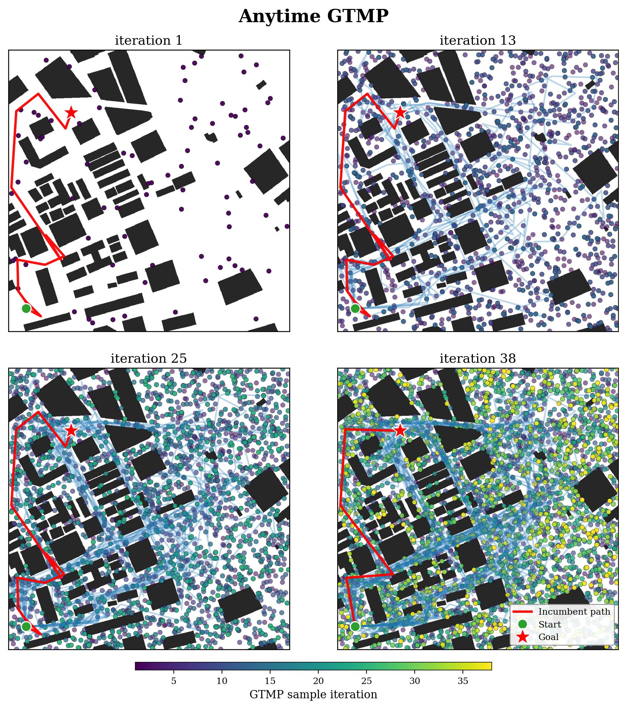
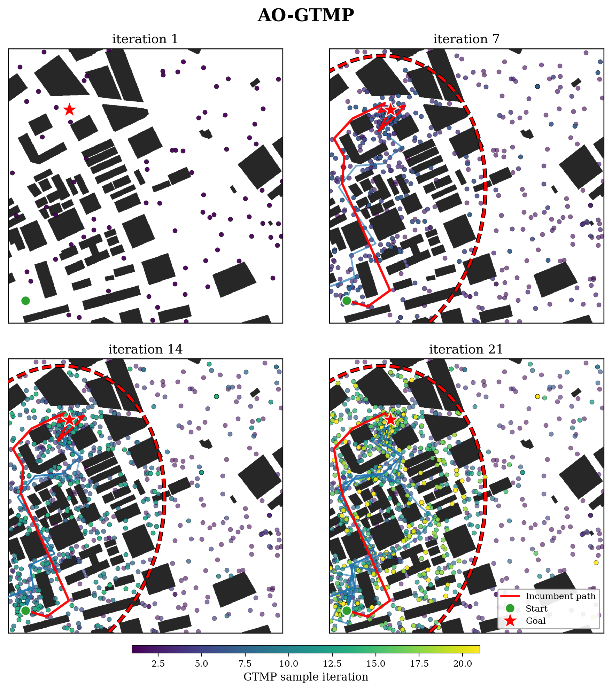
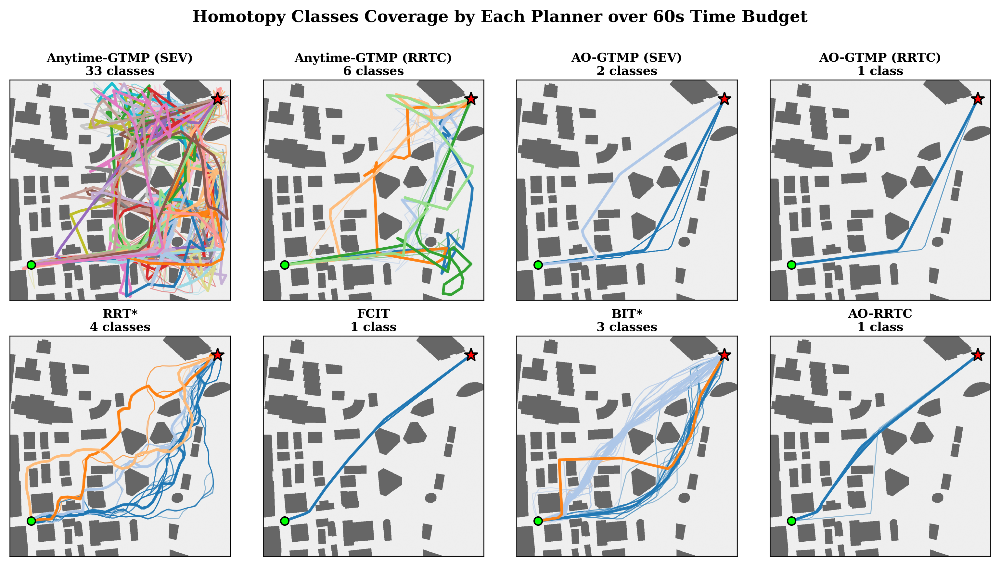

# Anytime GTMP

Sai Coumar. An T. Le, Zachary Kingston

Anytime GTMP extends Global Tensor Motion Planning [(GTMP)](https://github.com/anindex/gtmp.git) with connectorized graph edges generated by local planners from VAMP, enabling robust connections between sampled states. It formulates planning as an anytime, asymptotically optimal (AO) problem under a fixed time budget, progressively improving solution quality as computation time increases.

<p align="center">
  
  
</p>
<p align="center">
  
</p>

## Setup:
### Download Anytime Gtmp
```
git clone https://github.com/commalab/anytime_gtmp
cd anytime_gtmp
git submodule update --init --recursive
cd vamp
git checkout benchmark_aorrtc_backend
cd ..
```


### Install Dependencies Anytime Gtmp
```
uv venv --python 3.11
source .venv/bin/activate
uv pip install -e ./pyroffi
uv pip install -e ./vamp
uv pip install -r requirements.txt
```

### Citation
If you found this work useful, please consider citing:
```
@misc{coumar2026anytimeglobaltensormotion,
      title={Anytime Global Tensor Motion Planning}, 
      author={Sai Coumar and An T. Le and Zachary Kingston},
      year={2026},
      eprint={2608.25830},
      archivePrefix={arXiv},
      primaryClass={cs.RO},
      url={https://arxiv.org/abs/2608.25830}, 
}
```

### License
Our code is open source under the MIT license. See [LICENSE](LICENSE) for details. 